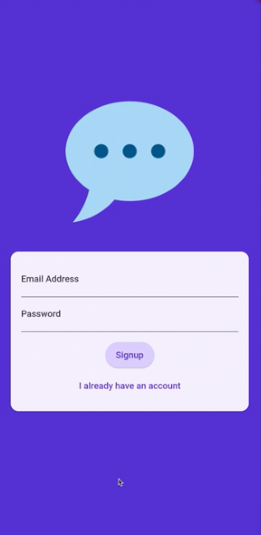
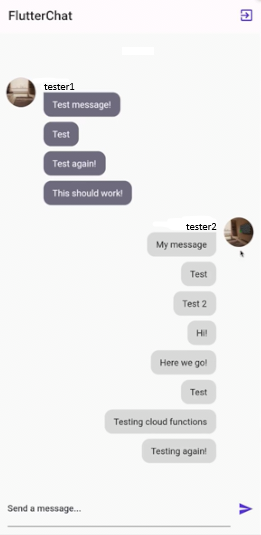

# ChatApp

A chat application built with **Flutter** and **Firebase**.  
Connect with friends, share messages, and enjoy a smooth real-time chat experience.

---

## 🖼 App Screenshots

<div style="display:flex; justify-content:center; gap:1%; margin-bottom:8px;">
  
  
</div>

<p style="text-align:left;"><b>Chat Interface</b><br>Real-time messaging with smooth UI. Supports text, images, and emojis for seamless conversations.</p>

<hr style="height:2px; background:#333; border:none;">

## ✨ Features

* Real-time chat using **Firebase**  
* User authentication

---

## 🛠 Technologies Used

* **Flutter**  
* **Dart**  
* **Firebase** (Auth, Firestore, Storage)  

---

## 🚀 Installation

Clone the repository:

```bash
git clone https://github.com/BilalGH2005/chatapp.git
